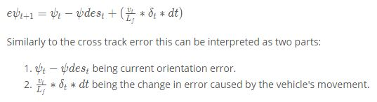

# CarND-MPC-Project 
Self-Driving Car Engineer ND Program

## 1. Overview
This project is a **nonlinear model predictive control (MPC)** problem with actuators delay for a slef-driving car in the simulator. The MPC considers the task for rolling horizons as an optimization problem, and also deals with actuators delay. This project is implemented with c++, Ipopt, CppAD.

One of the most foundamental and popular control systems is a Proportional (P), Integral (I), Differential (D), together, PID controller. But PID controller cannot be used for complex systems such as self-driving vehicles as one needs to guarantee a safe, smooth, fast journey with extra constraints like jerk minimization, comforness and so on.

MPC is built taking into consideration the motion model of the system. Hence, this controller adapts to any sort of extra requirments while making the decision, like speed range, accerleration range, comfortness, actuator delay, Lyapunov control rules, and even more sophiscated external factors under uncertainties.

<p align="center">

</p>

## 2. Kinematic Model (discretized)

- Here, x - the x position of the vehicle; y - the y position of the vehicle; psi - the direction of the vehicle; v - the vecolity of the vehicle; cte - cross
  track error; epsi - the error between psi and road direction; delta - the steering
angle; a - the throttle.

### 2.1 Calculations for cte and epsi



### 2.2 Cost Function
- Penalize cte and epsi that ensure the car to stay in the middle of line and
  head to the right direction
- Jerk minimization
- Minimize oscillations in the motion

### 2.3 Latency
In a real car, an actuation command won't execute instantly - there will be a delay as the command propagates through the system. A realistic delay might be on the order of 100 milliseconds. This is a problem called "latency", and it's a difficult challenge for some controllers - like a PID controller - to overcome. But a Model Predictive Controller can adapt quite well because we can model this latency in the system.

A contributing factor to latency is actuator dynamics. For example the time elapsed between when you command a steering angle to when that angle is actually achieved. This could easily be modeled by a simple dynamic system and incorporated into the vehicle model. One approach would be running a simulation using the vehicle model starting from the current state for the duration of the latency. The resulting state from the simulation is the new initial state for MPC.

In our method, latency is taken into account by constraining the controls to the values of the previous iteration for the duration of the latency. Thus the optimal trajectory is computed starting from the time after the latency period. This has the advantage that the dynamics during the latency period is still calculated according to the vehicle model.

### 2.4 Advanced Ipopt Setting with HSL 


## 3. Dependencies

* cmake >= 3.5
 * All OSes: [click here for installation instructions](https://cmake.org/install/)
* make >= 4.1(mac, linux), 3.81(Windows)
  * Linux: make is installed by default on most Linux distros
  * Mac: [install Xcode command line tools to get make](https://developer.apple.com/xcode/features/)
  * Windows: [Click here for installation instructions](http://gnuwin32.sourceforge.net/packages/make.htm)
* gcc/g++ >= 5.4
  * Linux: gcc / g++ is installed by default on most Linux distros
  * Mac: same deal as make - [install Xcode command line tools]((https://developer.apple.com/xcode/features/)
  * Windows: recommend using [MinGW](http://www.mingw.org/)
* [uWebSockets](https://github.com/uWebSockets/uWebSockets)
  * Run either `install-mac.sh` or `install-ubuntu.sh`.
  * If you install from source, checkout to commit `e94b6e1`, i.e.
    ```
    git clone https://github.com/uWebSockets/uWebSockets
    cd uWebSockets
    git checkout e94b6e1
    ```
    Some function signatures have changed in v0.14.x. See [this PR](https://github.com/udacity/CarND-MPC-Project/pull/3) for more details.

* **Ipopt and CppAD:** Please refer to [this document](https://github.com/udacity/CarND-MPC-Project/blob/master/install_Ipopt_CppAD.md) for installation instructions.
* [Eigen](http://eigen.tuxfamily.org/index.php?title=Main_Page). This is already part of the repo so you shouldn't have to worry about it.
* Simulator. You can download these from the [releases tab](https://github.com/udacity/self-driving-car-sim/releases).
* Not a dependency but read the [DATA.md](./DATA.md) for a description of the data sent back from the simulator.


## 4. Basic Build Instructions

1. Clone this repo.
2. Make a build directory: `mkdir build && cd build`
3. Compile: `cmake .. && make`
4. Run it: `./mpc`.

### 4.1 Build with Docker-Compose
The docker-compose can run the project into a container
and exposes the port required by the simulator to run.

1. Clone this repo.
2. Build image: `docker-compose build`
3. Run Container: `docker-compose up`
4. On code changes repeat steps 2 and 3.

## 5. Tips

* The MPC is recommended to be tested on examples to see if implementation behaves as desired. One possible example
is the vehicle offset of a straight line (reference). If the MPC implementation is correct, it tracks the reference line after some timesteps(not too many).
* The `lake_track_waypoints.csv` file has waypoints of the lake track. This could fit polynomials and points and see of how well your model tracks curve. NOTE: This file might be not completely in sync with the simulator so your solution should NOT depend on it.
* For visualization this C++ [matplotlib wrapper](https://github.com/lava/matplotlib-cpp) could be helpful.)
*  Tips for setting up your environment are available [here](https://classroom.udacity.com/nanodegrees/nd013/parts/40f38239-66b6-46ec-ae68-03afd8a601c8/modules/0949fca6-b379-42af-a919-ee50aa304e6a/lessons/f758c44c-5e40-4e01-93b5-1a82aa4e044f/concepts/23d376c7-0195-4276-bdf0-e02f1f3c665d)

